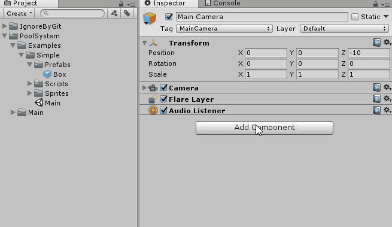

SimplePoolSystem
==============
Copyright (c) 2017 -2019 Unity Project by James Roman


What is Object Pooling?
==============
In many games is normal, that we are constantly creating and destroying objects, (such as bullets or enemies), using Instantiate and Destroy respectively, but really these objects that we destroy, still occupy a space in our memory, so destroy many objects can make a game quite slow, or even unplayable on platforms with fewer resources.

That is why a well-known technique called object polling is used, which simply consists in reducing the amount of objects that are created in our games, basically the objects are not destroyed, we just deactivate and activate then for convenience.

Getting started
==============
Just download and import [this](https://github.com/platinio/SimplePoolSystem/releases/download/1.0/SimplePoolSystem.1.0f.unitypackage) 

use the Platinio.PoolSystem name space.
```c#
using Platinio.PoolSystem;
```
and you are ready to go.

Creating a Pool using the Inspector
==============

Just use the script PoolManager.cs and create as many pools as you need.



Creating a Pool from Code
==============
For sure there will be moments, when you need to create a pool from code.

```c#
PoolManager.instance.CreatePool(poolPrefab , maxPoolSize , initialPoolSize);
```

Instantianting (Spawning)
==============

Now instead of Instantiating objects we will be spawning objects, but dont worry works very similar to Instantiate.

```c#
using UnityEngine;
using Platinio.PoolSystem;

public class SpawningTest : MonoBehaviour
{
    public GameObject prefab = null;

    private void Awake()
    {
        //Spawn our prefab in Vector3.zero position
        prefab.Spawn(Vector3.zero);
    }
}
```

As you can see now we need to use our prefab in order to spawn (or Instantiate) objects.

Destroying (Unspawning)
==============

Now instead of caling Destroy we will be using Unspawn.

```c#
using UnityEngine;
using Platinio.PoolSystem;

public class UnspawningTest : MonoBehaviour
{
    public GameObject prefab = null;

    private void Awake()
    {
        //Create a prefab
        GameObject clone = prefab.Spawn(Vector3.zero);
        //Destroy or Unspawn the prefab
        clone.Unspawn();
    }
}

```

OnSpawn and OnUnspawn
==============

As you know using pooling we are no Instantiating or Destroying (or we try), so we use OnSpawn and OnUnspawn as callbacks.

```c#
using UnityEngine;

public class EventTest : MonoBehaviour
{
    private void OnUnspawn()
    {
        Debug.Log( "Called when this GameObject is Unspawned");
    }

    private void OnSpawn()
    {
        Debug.Log( "Called when this GameObject is Spawned" );
    }
}
```

Remember!
==============
It is important that you remember that we are recycling objects, that means what if you use Spawn to create an enemy with 100 hit points, and use Unspawn to destroy it when his hit points reaches 0, when this object is reused, it will appear having 0 hit points aigan, because it is the same old object.

So what you need to do in order to avoid this, is to use the OnSpawn callback to reset all object properties (such as hp and ammo).

```c#
using UnityEngine;
using Platinio.PoolSystem;

public class Enemy : MonoBehaviour
{
    public float maxHP = 100.0f;
    public int maxAmmo = 30;

    private float currentHP;
    private int currenAmmo;

    private void OnSpawn()
    {
        //reset object properties
        currentHP = maxHP;
        currenAmmo = maxAmmo;
    }

    public void DoDamage(float dmg)
    {
        currentHP -= dmg;

        if (currentHP <= 0.0f)
        {
            currentHP = 0.0f;
            gameObject.Unspawn();
        }
    }
}

```


